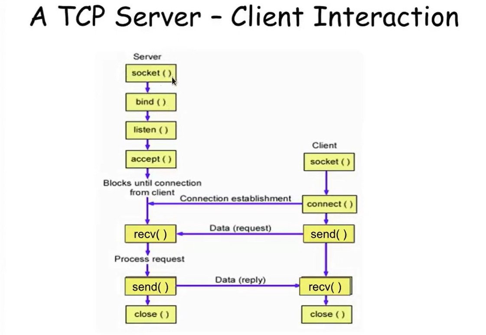
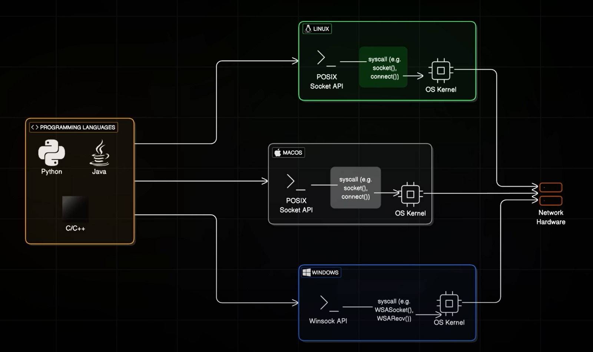
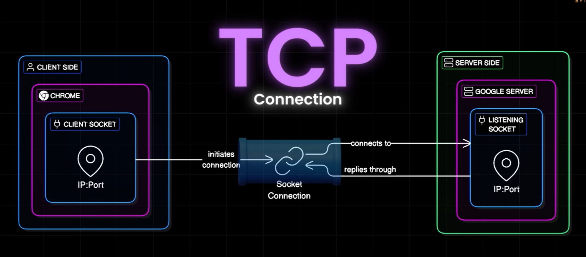
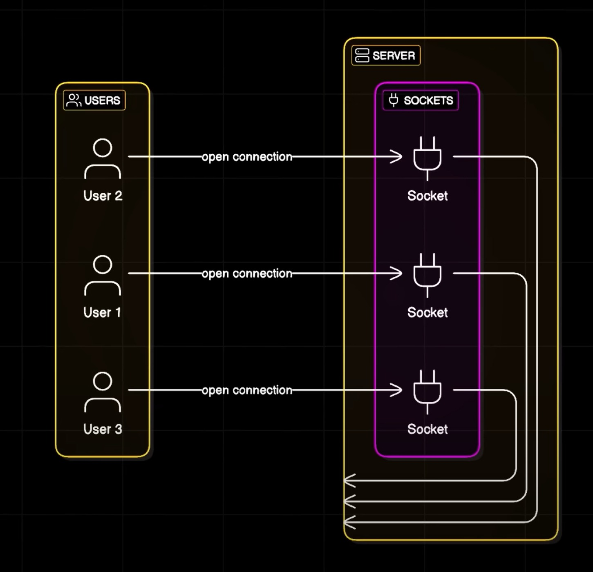

#  High-Performance HTTP Server on a Custom TCP Layer

<p align="center">
  
</p>

>  A clean, production-style **HTTP/1.1 server** built on top of a **cross‑platform TCP layer** (Windows + Linux + MacOs). Features a **state-machine HTTP parser**, **Builder-pattern responses**, **non-blocking I/O** with `poll/epoll/WSAPoll`, and is engineered to scale to **10K~15k concurrent connections**

---

## Table of Contents

- [Goals & Non-Goals](#goals--non-goals)
- [Architecture Overview](#architecture-overview)
- [Folder Structure](#folder-structure)
- [Build & Run](#build--run)
- [Core Concepts](#core-concepts)
  - [1) TCP Server Layer](#1-tcp-server-layer)
  - [2) HTTP Protocol Layer](#2-http-protocol-layer)
  - [3) Connection Lifecycle & Backpressure](#3-connection-lifecycle--backpressure)
  - [4) Threading Models](#4-threading-models)
  - [5) Error Handling & Timeouts](#5-error-handling--timeouts)
- [Performance & 10K+ Concurrency](#performance--10k-concurrency)

---

## Goals & Non-Goals

**Goals**
- Production-quality, **readable** C++14 code with clear separation between **TCP** and **HTTP**.
- **Cross-platform**: Linux (POSIX + `epoll`/`poll`) and Windows (Winsock2 + `WSAPoll`).
- **Scalable** design capable of **10,000+ concurrent Connections**.
- Provide **simple hooks** so users can implement routing/handlers easily.
- Solid defaults: correct `Content-Length`, keep-alive and defensible parsing.

**Non-Goals (for this release)**
- Full HTTP/1.1 spec (chunked encoding, trailers) — documented how to add.
- TLS/HTTPS and HTTP/2 (can be layered next).
- Advanced routing framework — keep the core lean, let apps build on top like HFTs Trading Softwares.

---

## Architecture Overview

<p align="center">
  
</p>

```
+---------------------------  Application (Your handlers)  ---------------------------+
|                                                                                     |
|  HttpConnection -> calls user Handler(HttpRequest) -> returns HttpResponse          |
|                                                                                     |
+---------------------------  HTTP Layer  --------------------------------------------+
|  httprequest.(h|cpp)  : state-machine parser (RequestLine -> Headers -> Body)       |
|  httpresponse.(h|cpp) : Builder pattern for responses (auto Content-Length, etc.)   |
|  connect.(h|cpp)      : per-connection I/O, parse, queue responses                  |
+---------------------------  TCP Layer  ---------------------------------------------+
|  lin.(h|cpp) : Linux server (non-blocking sockets + epoll/poll)                     |
|  win.(h|cpp) : Windows server (Winsock2 + WSAPoll)                                  |
+-------------------------------------------------------------------------------------+
```

**Data Flow**
1. TCP server accepts a client and registers its fd for `READ` (and `WRITE` when needed).
2. `HttpConnection::onReadable()` **feeds bytes** into the incremental parser.
3. Each complete `HttpRequest` triggers your **handler**, producing an `HttpResponse`.
4. The response is **serialized** and pushed to a **send queue**


---

## Folder Structure

```
project-root/
├── CMakeLists.txt
├── examples/
│   ├── server.cpp                  # minimal example using HTTP layer
│   └── client.cpp                  # simple HTTP GET client
├── http/
│   ├── connect.h
│   ├── connect.cpp                 # HttpConnection (per-connection state & I/O)
│   ├── httprequest.h
│   ├── httprequest.cpp             # State-machine HTTP/1.1 parser
│   ├── httpresponse.h
│   └── httpresponse.cpp            # Builder-pattern response
├── tcp/
│   ├── tcpserver.h                 # abstract base / factory
│   ├── tcpclient.h                 # test client interface
│   ├── lin.h
│   ├── lin.cpp                     # Linux impl (epoll/poll)
│   ├── win.h
│   └── win.cpp                     # Windows impl (Winsock2 + WSAPoll)
└── README.md
```

> 
<p align="center">
  
</p>

---

## Build & Run

### Prerequisites
- **Linux**: `g++` (or `clang++`), `cmake >= 3.10`, `make`
- **Windows**: Visual Studio 2019+ (MSVC), `cmake >= 3.20`

### Linux
```bash
mkdir build && cd build
cmake -DCMAKE_BUILD_TYPE=Release ..
cmake --build . -j
./examples/server
```


### Try it
```bash
curl -v http://127.0.0.1:8080/
```

---

## Core Concepts

### 1) TCP Server Layer

**Linux (`lin.cpp/h`)**
- Create non-blocking socket → `bind` → `listen`.
- Register **server fd** in `epoll` (or `poll`) for `EPOLLIN` (readable = incoming accept).
- On accept:
  - Set **client fd** non-blocking.
  - Wrap in `HttpConnection` and store in a map: `fd -> shared_ptr<HttpConnection>`.
  - Register client fd with `EPOLLIN` and conditionally `EPOLLOUT` when `conn->wantsWrite()`.

**Windows (`win.cpp/h`)**
- `WSAStartup` → `socket` → `bind` → `listen`.
- Use `WSAPoll` on a vector of `WSAPOLLFD` (server fd + client fds).
- On `POLLRDNORM` for server fd → `accept` → push a new `WSAPOLLFD` + create `HttpConnection`.
- Delegate client events to `onReadable/onWritable`.

**Why non-blocking + readiness I/O?**
- One thread can multiplex **tens of thousands** of sockets.
- Avoids thread-per-connection overhead, context switching, and memory bloat.

**Backlog & Accept Queue**
- Use `SOMAXCONN` (or high values) for backlog.
- Linux: pass a large backlog to `listen`, tune `net.core.somaxconn` if needed.

---

### 2) HTTP Protocol Layer

**Request Model (`httprequest.h`)**
- `method`, `target` (path + query), `version`, `headers` (lowercased keys), `body`.
- `keepAlive()` implements HTTP/1.1 default-keepalive semantics (`Connection: close` opt-out).

**State-Machine Parser (`httprequest.cpp`)**
States:
- `RequestLine` → parse `"METHOD SP TARGET SP HTTP/VERSION\\r\\n"`.
- `Headers` → read lines until empty `\\r\\n`.
- `Body` → read **exactly** `Content-Length` bytes (chunked is optional extension).
- `Done` → one complete request produced (support pipelining, i.e., multiple requests in a single TCP read).
- `Error` → stop and surface a 400.

**Design Notes**
- **Incremental**: Works with partial packets (TCP is a stream).
- **Robust**: Reject malformed lines and bad `Content-Length`.
- **Pipelining**: Multiple requests can be parsed from one buffer without extra reads.

**Response Builder (`httpresponse.h/.cpp`)**
- `HttpResponse::Builder`
  - `.status(code, reason)`
  - `.version("HTTP/1.1")`
  - `.header(k, v)`
  - `.body(string)`
  - `.keepAlive(bool)` → auto-injects `Connection` header
- Auto-sets `Content-Length` (and default `Content-Type: text/plain; charset=utf-8`).
- `serialize()` returns a **single contiguous string** ready for `send()`.

**Per-Connection Orchestrator (`connect.h/.cpp`)**
- `onReadable()`:
  - `recv()` into a temporary buffer.
  - Feed bytes to parser.
  - For each completed request → call user **Handler(req)** → enqueue `resp.serialize()`.
  - On parse error → enqueue `400 Bad Request`, then allow writeout and close.
- `onWritable()`:
  - Drain the **send queue** with `send()` (handles **partial writes**).
  - If queue becomes empty, stop polling for `WRITE` on this fd.
- `wantsWrite()`:
  - Exposes whether there is pending data; the TCP layer uses it to toggle `POLLOUT`/`EPOLLOUT`.

---

### 3) Connection Lifecycle & Backpressure

**Backpressure** occurs when the peer reads slower than we write. We handle it by:
- **Queueing** serialized responses per-connection (`deque<string>`).
- Toggling `POLLOUT/EPOLLOUT` **only when** the queue is non-empty.
- Applying **caps** (e.g., max queued bytes per connection). If exceeded → close or 503.

**Keep-Alive & Close**
- HTTP/1.1 defaults to **keep-alive**. If client sends `Connection: close`, we honor it.
- After sending the final response for a close-intent request, we close the socket gracefully.

**Timeouts (recommended)**
- Idle read timeout (e.g., 60s).
- Write stall timeout (e.g., 30s).
- Header-read deadline to mitigate Slowloris (e.g., 10s).

---

### 4) Threading Models

**A) Single-Threaded Reactor (default)**
- One thread handles accept + I/O multiplexing.
- Simple and surprisingly fast for many workloads.

**B) Reactor + Worker Pool**
- Network thread parses requests and pushes them to a **work queue** for CPU-heavy handlers.
- Workers return `HttpResponse` back to the connection for send.
- Use **lock-free** or MPMC queues where possible.

**C) Shard by Affinity (Advanced)**
- Hash by **fd** or **URL path**/**host** into N reactors (each with own epoll).
- Near-linear scalability on multi-core systems.

---

### 5) Error Handling & Timeouts

- **Parsing errors** → 400 Bad Request + close (after flush).
- **System call errors**:
  - Recoverable (EAGAIN/EWOULDBLOCK) → retry later.
  - Fatal (ECONNRESET, EPIPE, etc.) → close connection.
- **Graceful shutdown**:
  - Stop accepting.
  - Flush queues with a deadline, then close.
- **Logging**: Prefer structured logs (JSON or key=value) for production.

---

## Performance & 10K+ Concurrency

**How we get there:**
- **Non-blocking sockets** + readiness I/O.
- Efficient **string handling** and **buffer reuse**.
- Minimal copies: build response once, write once (or as few syscalls as possible).
- Avoid global locks; prefer per-connection state.

**Memory budgeting (rule-of-thumb)**
- With ~2–4 KiB average per connection (metadata + small queues), 50K connections ≈ 100–200 MiB RAM.
- Cap per-connection send queue and header size to prevent OOM under load.

**When to consider IOCP (Windows)**
- `WSAPoll` is fine into the tens of thousands; for 100K+ sustained, move to **IOCP**.


<p align="center">
  
</p>

---


## Appendix: Code Snippets

**Minimal Handler (examples/server.cpp)**
```cpp
#include "http/connect.h"
#include "tcp/tcpserver.h"
#include <memory>
#include <unordered_map>

static HttpResponse handleRequest(const HttpRequest& req) {
    if (req.method == "GET" && (req.target == "/" || req.target == "/health")) {
        return HttpResponse::Builder{}
            .status(200, "OK")
            .header("Content-Type", "text/plain; charset=utf-8")
            .body("OK\n")
            .keepAlive(req.keepAlive())
            .build();
    }
    return HttpResponse::Builder{}
        .status(404, "Not Found")
        .header("Content-Type", "text/plain; charset=utf-8")
        .body("Not Found\n")
        .keepAlive(req.keepAlive())
        .build();
}

int main() {
    std::unique_ptr<TCPServer> server(createserver()); // factory picks Linux/Windows
    if (!server->initialize(8080, "0.0.0.0")) return 1;
    // In your accept path: wrap accepted fd with HttpConnection(fd, handleRequest)
    server->start();
    return 0;
}
```

**Client Example (examples/client.cpp)**
```cpp
#include "tcpclient.h"
#include <iostream>
#include <memory>
int main() {
    std::unique_ptr<TCPClient> client(createClient());
    if (!client->connectToServer("127.0.0.1", 8080)) return 1;
    std::string req = 
        "GET / HTTP/1.1\r\n"
        "Host: 127.0.0.1\r\n"
        "Connection: close\r\n"
        "\r\n";
    client->sendData(req);
    std::cout << client->receiveData() << std::endl;
    client->disconnect();
    return 0;
}
```